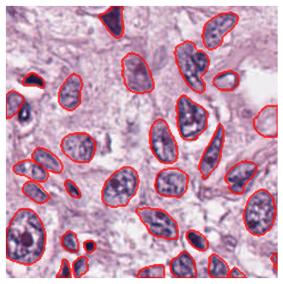

# PanNuke_NoNuSeg_cpm17_ConSep_Preprocess

A repository for preprocessing widely used H&E image datasets, including PanNuke, MoNuSeg, CPM17, and ConSep, to facilitate nuclei segmentation tasks with deep learning models.

## Datasets

### PanNuke
PanNuke is an H&E stained image dataset containing 7,904 256 × 256 patches from 19 different tissue types. The nuclei are classified into the following categories:
- Neoplastic
- Inflammatory
- Connective/Soft Tissue
- Dead
- Epithelial Cells

The dataset is divided into three folds for use in cross-validation. You can download the dataset [here](https://jgamper.github.io/PanNukeDataset/).

#### Prepare the Data

After downloading the PanNuke dataset, you will receive three `.zip` files named `fold1.zip`, `fold2.zip`, and `fold3.zip`. These files contain the data stored as NumPy arrays. Once extracted, the directory structure will be as follows:

```
📦Fold 1
 ┣ 📂images
 ┃ ┗ 📂fold1
 ┃ ┃ ┣ 📜images.npy
 ┃ ┃ ┗ 📜types.npy
 ┣ 📂masks
 ┃ ┣ 📂fold1
 ┃ ┃ ┗ 📜masks.npy
 ┃ ┣ 📜by-nc-sa.md
 ┃ ┗ 📜README.md
 ┗ 📜README.md
```
Fold 2 and 3 also have similar structure

how to run the preprocess code:

```bash
python3 pannuke_process.py
```
The following is a sample of the preprocessed output:


### Instructions for Preparation
1. Download the `.zip` files from the [official PanNuke dataset page](https://jgamper.github.io/PanNukeDataset/).
2. Extract each `.zip` file into a separate folder (`Fold 1`, `Fold 2`, `Fold 3`).
3. Verify the directory structure as shown above.

You are now ready to preprocess the data using this repository.


### MoNuSeg
The dataset for this challenge was obtained by carefully annotating tissue images of several patients with tumors of different organs and who were diagnosed at multiple hospitals. This dataset was created by downloading H&E stained tissue images captured at 40x magnification from TCGA archive. H&E staining is a routine protocol to enhance the contrast of a tissue section and is commonly used for tumor assessment (grading, staging, etc.). Given the diversity of nuclei appearances across multiple organs and patients, and the richness of staining protocols adopted at multiple hospitals, the training datatset will enable the development of robust and generalizable nuclei segmentation techniques that will work right out of the box.

The dataset is divided into two sections: train and test. You can download the dataset [here](https://monuseg.grand-challenge.org/).

After unzip the data directory is:
```
📦Train
 ┣ 📂images
  ┃ ┣ 📜XXX.tif
 ┣ 📂masks
  ┃ ┣ 📜XXX.png
Test
 ┣ 📂images
  ┃ ┣ 📜XXX.tif
 ┣ 📂masks
  ┃ ┣ 📜XXX.png
```
how to run the preprocess code:

```bash
python3 monuseg_process.py
```
### CPM17

The Third dataset is **CPM17 (Computational Precision Medicine Digital Pathology Challenge)**. It includes 64 H&E-stained histopathology images, each with a size of 500×500 pixels, featuring 7,570 annotated nuclear boundaries. Following the original challenge specifications, the dataset is divided into two sets:
- **Training Set**: 32 images
- **Testing Set**: 32 images

You can download the dataset [here](https://drive.google.com/drive/folders/1l55cv3DuY-f7-JotDN7N5nbNnjbLWchK).

---

how to run the preprocess code:

```bash
# train
python3 process_cpm17.py --dataset CPM17 --subset train

# test
python3 process_cpm17.py --dataset CPM17 --subset test

```

### ConSep

ConSep is the fourth dataset, containing manually annotated 24,319 nuclei with associated class labels. This dataset is widely used for nuclei segmentation and classification tasks.

You can download the dataset from [here](https://warwick.ac.uk/fac/sci/dcs/research/tia/data/hovernet/).


how to run the preprocess code:

```bash
python3 preprocess_consep.py
```


